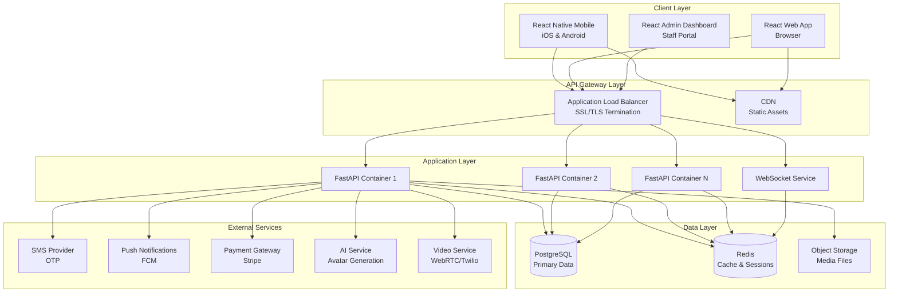

# Design Document

## Overview

The Lutend platform is designed as a monorepo containing multiple applications that work together to provide a comprehensive matchmaking service. The architecture follows a client-server model with a centralized Python FastAPI backend serving multiple frontend clients (React Native mobile, React web, React admin dashboard). Infrastructure is managed as code using Terraform to enable cloud-agnostic deployment.

### Key Design Principles

1. **Separation of Concerns**: Each application (backend, mobile, web, admin) is independently deployable but shares common types and utilities
2. **API-First Design**: Backend exposes a well-documented REST API with OpenAPI specification
3. **Type Safety**: TypeScript across all frontends with generated types from backend schema
4. **Cloud Agnostic**: Terraform modules abstract cloud provider specifics
5. **Scalability**: Containerized backend with horizontal scaling capabilities
6. **Security**: Multi-layer security with encryption, authentication, and authorization
7. **Real-time Features**: WebSocket support for chat and live updates

## Architecture

### High-Level System Architecture



### Monorepo Structure

```
lutend/
├── backend/                    # Python FastAPI backend
│   ├── app/
│   │   ├── api/               # API routes and endpoints
│   │   ├── core/              # Core configuration and settings
│   │   ├── models/            # SQLAlchemy database models
│   │   ├── schemas/           # Pydantic request/response schemas
│   │   ├── services/          # Business logic layer
│   │   ├── utils/             # Utility functions
│   │   └── main.py            # Application entry point
│   ├── alembic/               # Database migrations
│   ├── tests/                 # Backend tests
│   ├── Dockerfile             # Container definition
│   ├── requirements.txt       # Python dependencies
│   └── pyproject.toml         # Python project config
│
├── mobile/                     # React Native mobile app
│   ├── src/
│   │   ├── screens/           # Screen components
│   │   ├── components/        # Reusable UI components
│   │   ├── navigation/        # Navigation configuration
│   │   ├── services/          # API integration layer
│   │   ├── hooks/             # Custom React hooks
│   │   ├── store/             # State management (Redux/Zustand)
│   │   └── App.tsx            # Root component
│   ├── ios/                   # iOS native code and config
│   ├── android/               # Android native code and config
│   ├── package.json           # Dependencies
│   └── tsconfig.json          # TypeScript config
│
├── web/                        # React web app
│   ├── src/
│   │   ├── pages/             # Page components
│   │   ├── components/        # Reusable UI components
│   │   ├── services/          # API integration layer
│   │   ├── hooks/             # Custom React hooks
│   │   ├── store/             # State management
│   │   └── App.tsx            # Root component
│   ├── public/                # Static assets
│   ├── package.json           # Dependencies
│   └── tsconfig.json          # TypeScript config
│
├── admin/                      # React admin dashboard
│   ├── src/
│   │   ├── pages/             # Admin pages
│   │   ├── components/        # Admin-specific components
│   │   ├── services/          # API integration layer
│   │   └── App.tsx            # Root component
│   ├── package.json           # Dependencies
│   └── tsconfig.json          # TypeScript config
│
├── infrastructure/             # Terraform IaC
│   ├── modules/               # Reusable Terraform modules
│   │   ├── compute/           # Container orchestration (ECS/GKE/AKS)
│   │   ├── database/          # Database resources (RDS/CloudSQL/Azure DB)
│   │   ├── networking/        # VPC, subnets, load balancers
│   │   ├── storage/           # Object storage (S3/GCS/Blob)
│   │   ├── cache/             # Redis/Memcached
│   │   └── monitoring/        # Logging, metrics, alerting
│   ├── environments/          # Environment-specific configs
│   │   ├── dev/
│   │   ├── staging/
│   │   └── production/
│   └── providers/             # Cloud provider implementations
│       ├── aws/
│       ├── gcp/
│       └── azure/
│
├── shared/                     # Shared code across applications
│   ├── types/                 # TypeScript type definitions
│   ├── api-client/            # Generated API client SDK
│   ├── components/            # Shared UI components
│   ├── utils/                 # Shared utility functions
│   └── design-tokens/         # Design system tokens (colors, spacing, etc.)
│
├── docs/                       # Documentation
│   ├── adr/                   # Architecture Decision Records
│   ├── api/                   # API documentation
│   ├── deployment/            # Deployment guides
│   └── development/           # Development setup guides
│
├── .github/                    # GitHub Actions workflows
│   └── workflows/
│       ├── backend-ci.yml     # Backend CI/CD
│       ├── mobile-ci.yml      # Mobile CI/CD
│       ├── web-ci.yml         # Web CI/CD
│       ├── admin-ci.yml       # Admin CI/CD
│       └── infrastructure.yml # Terraform validation
│
├── docker-compose.yml          # Local development environment
├── package.json                # Root package.json for workspaces
├── pnpm-workspace.yaml         # PNPM workspace configuration
└── README.md                   # Project documentation
```

## Components and Interfaces

### Backend Service Architecture

#### Service Layer Organization

**Authentication Service**

- Handles user authentication and token management
- OTP generation and verification
- Social account linking (Google, Facebook, Apple, X)
- JWT token issuance and refresh
- Dependencies: SMS provider API, Redis for OTP storage

**User Service**

- User profile CRUD operations
- Preference management and ordering
- Profile approval workflow
- Dependencies: PostgreSQL, Redis cache

**Onboarding Service**

- Questionnaire flow management
- Progress tracking
- Intent-based question routing
- Dependencies: PostgreSQL

**Verification Service**

- Photo upload and storage
- AI avatar generation integration
- Identity verification workflow
- Admin review queue management
- Dependencies: S3 storage, AI service API, PostgreSQL

**Matching Service**

- Matching algorithm implementation
- Compatibility scoring
- Search session management
- Parallel search tracking (max 3 per user)
- Dependencies: PostgreSQL, Redis, Background task queue

**Meeting Service**

- Meeting scheduling coordination
- Time slot management
- Video call credential generation
- Meeting lifecycle tracking
- Dependencies: PostgreSQL, Video service API, Redis

**Feedback Service**

- Post-meeting feedback collection
- Action processing (chat enable, reveal details, etc.)
- Mutual decision handling
- Dependencies: PostgreSQL, Redis, Push notification service

**Chat Service**

- Real-time messaging
- Chat expiration management (30 days, 7-day ghosting)
- Message history
- Dependencies: PostgreSQL, Redis, WebSocket server

**Content Service**

- Educational content delivery
- Comment and reply management
- Engagement tracking
- Dependencies: PostgreSQL, Redis cache

**Payment Service**

- Credit balance management
- Payment gateway integration
- Transaction recording
- Refund processing
- Dependencies: Payment gateway API, PostgreSQL

**Admin Service**

- Verification review operations
- User moderation (ban, warn)
- Report management
- Content moderation
- Dependencies: PostgreSQL, Push notification service

#### API Endpoint Structure

```
/api/v1/
├── /auth                      # Authentication endpoints
├── /users                     # User profile management
├── /onboarding                # Onboarding questionnaire
├── /verification              # Identity verification
├── /matches                   # Match search and management
├── /meetings                  # Meeting scheduling and lifecycle
├── /chats                     # Chat management
├── /content                   # Content feed and interactions
├── /credits                   # Credit management and purchases
├── /admin                     # Admin operations
└── /ws                        # WebSocket endpoints
```

### Frontend Application Structure

#### React Native Mobile App

**Screen Organization**

- Auth: Welcome, phone input, OTP verification
- Onboarding: Intent selection, questionnaire, progress tracking
- Verification: Photo upload, avatar selection, video verification
- Dashboard: Main navigation hub
- Meet: Search, match profile, scheduling, video call, feedback
- Chat: Chat list, individual chat conversations
- Profile: Profile view/edit, preferences management
- Content: Feed, article/video detail
- Credits: Balance, purchase, offers
- Settings: Notifications, account, legal pages

**Component Structure**

- Common: Buttons, inputs, cards, avatars, modals
- Meet-specific: Match cards, time slot pickers, video controls
- Chat-specific: Message bubbles, chat input, typing indicators
- Content-specific: Article cards, video players, comment threads

**Navigation**

- Stack navigation for auth flow
- Tab navigation for main dashboard
- Modal navigation for overlays

**State Management**

- Redux Toolkit or Zustand for global state
- React Query for server state and caching
- Context API for theme and localization

**Services**

- API client wrapper
- Authentication service
- Secure storage service
- Push notification service
- Deep linking service

#### React Web App

**Page Organization**

- Similar to mobile screens but adapted for web layout
- Sidebar navigation instead of bottom tabs
- Responsive design for desktop, tablet, mobile viewports

**Component Structure**

- Shared components with mobile where possible
- Web-specific: Sidebar, header, breadcrumbs
- Form components with web validation
- Modal and drawer components

**Routing**

- React Router for client-side routing
- Protected routes for authenticated pages
- URL-based state management

**State Management**

- Same approach as mobile (Redux/Zustand + React Query)
- localStorage for persistence

#### React Admin Dashboard

**Page Organization**

- Dashboard: Overview metrics and charts
- Verifications: Pending queue, review interface
- Users: Search, list, detail, moderation actions
- Content: CMS for articles and videos
- Reports: User reports with meeting logs
- Analytics: Platform metrics and insights
- Support: Ticket management

**Component Structure**

- Layout: Sidebar, header, breadcrumbs
- Tables: Data tables with sorting, filtering, pagination
- Forms: Form builder for content creation
- Charts: Analytics visualizations
- Modals: Confirmation dialogs, detail views

**Admin-Specific Features**

- Role-based UI rendering
- Audit log display
- Bulk action support
- Advanced filtering and search

## Data Models

### Database Schema Overview

**Core Tables**

- users: User accounts and authentication
- user_profiles: Extended profile information
- user_preferences: Matching preferences with priority
- user_questions: Custom questions for matches (max 3)
- social_accounts: Linked social login accounts
- verification_materials: Photos, avatars, ID scans

**Matching Tables**

- matches: Match records with compatibility scores
- match_timeslots: Proposed meeting times and voice notes
- search_sessions: Active search tracking

**Meeting Tables**

- meetings: Scheduled meetings with status
- meeting_feedback: Post-meeting ratings and actions

**Chat Tables**

- chats: Chat sessions with expiration tracking
- messages: Individual messages with timestamps

**Content Tables**

- content: Articles and videos
- content_comments: Comments with threading support

**Transaction Tables**

- credit_transactions: Credit purchases and usage
- admin_actions: Audit log of admin operations

### Redis Data Structures

**Session Management**

- Key pattern: `session:{user_id}`
- Type: Hash
- Contains: access_token, refresh_token, expires_at
- TTL: 7 days

**OTP Storage**

- Key pattern: `otp:{phone_number}`
- Type: String
- Contains: 6-digit OTP code
- TTL: 5 minutes

**Active Searches**

- Key pattern: `active_searches:{user_id}`
- Type: Set
- Contains: search_session_ids
- TTL: 24 hours

**Match Notifications Queue**

- Key pattern: `match_notifications`
- Type: List
- Contains: JSON objects with user_id and match_id

**Chat Presence**

- Key pattern: `chat_presence:{chat_id}:{user_id}`
- Type: String
- Contains: "online" or "offline"
- TTL: 5 minutes (refreshed on activity)

**Rate Limiting**

- Key pattern: `rate_limit:{endpoint}:{user_id}`
- Type: String (counter)
- TTL: Based on rate limit window

## Error Handling

### Backend Error Strategy

**HTTP Status Code Usage**

- 2xx: Success responses
- 4xx: Client errors (validation, authentication, authorization)
- 5xx: Server errors (unexpected failures, external service issues)

**Error Response Format**

- Consistent JSON structure across all endpoints
- Error code for programmatic handling
- Human-readable message
- Optional details array for field-level errors
- Request ID for tracing

**Error Categories**

- Authentication errors
- Validation errors
- Business logic errors
- External service errors
- Database errors
- Rate limiting errors

**Exception Handling**

- Global exception handler middleware
- Custom exception classes for different error types
- Logging with context and stack traces
- Sentry integration for error tracking

### Frontend Error Handling

**API Client Error Handling**

- Axios interceptors for global error handling
- Error parsing and transformation
- Retry logic for transient failures
- Network error detection

**User-Friendly Messaging**

- Error code to message mapping
- Contextual error messages
- Actionable error suggestions
- Toast/snackbar notifications

**Retry Strategies**

- Exponential backoff for retryable errors
- Maximum retry attempts
- User-initiated retry option
- Offline queue for critical operations

## Testing Strategy

### Backend Testing

**Unit Tests**

- Framework: pytest
- Coverage target: 80% minimum
- Focus: Service layer, utilities, algorithms
- Mocking: External services, database

**Integration Tests**

- Framework: pytest with TestClient
- Database: Test PostgreSQL instance
- Focus: API endpoints, database operations
- Fixtures: Test data setup and teardown

**Load Tests**

- Framework: Locust or k6
- Scenarios: Concurrent users, match searches, video calls, chat messages
- Metrics: Response time, throughput, error rate

### Frontend Testing

**Unit Tests**

- Framework: Jest + React Testing Library
- Coverage target: 70% minimum
- Focus: Components, hooks, utilities
- Mocking: API calls, navigation

**Integration Tests**

- Framework: Jest with MSW (Mock Service Worker)
- Focus: User flows, API integration, state management

**E2E Tests**

- Mobile: Detox
- Web: Playwright or Cypress
- Critical flows: Onboarding, matching, video calls, chat, payments

### Infrastructure Testing

**Terraform Validation**

- terraform validate: Syntax checking
- terraform plan: Resource planning
- tfsec: Security scanning
- infracost: Cost estimation

**Infrastructure Tests**

- Framework: Terratest (Go)
- Focus: Resource creation, networking, security groups

## Infrastructure Design

### Cloud-Agnostic Approach

**Terraform Module Structure**

- Abstract modules for compute, database, storage, networking
- Provider-specific implementations under each module
- Environment-specific variable files
- Shared variables and outputs

**Provider Abstraction**

- Conditional module loading based on provider variable
- Consistent interface across providers
- Provider-specific optimizations where needed

### Container Orchestration

**Compute Layer**

- AWS: ECS with Fargate
- GCP: Cloud Run or GKE
- Azure: Container Instances or AKS

**Features**

- Auto-scaling based on CPU/memory
- Health checks and automatic recovery
- Blue-green or canary deployments
- Container registry integration

### Database Layer

**Primary Database**

- AWS: RDS PostgreSQL
- GCP: Cloud SQL PostgreSQL
- Azure: Azure Database for PostgreSQL

**Features**

- Automated backups with point-in-time recovery
- Read replicas for scaling
- Encryption at rest and in transit
- Multi-AZ for high availability

**Cache Layer**

- AWS: ElastiCache Redis
- GCP: Memorystore Redis
- Azure: Azure Cache for Redis

**Features**

- Cluster mode for scalability
- Automatic failover
- Encryption and authentication

### Storage Layer

**Object Storage**

- AWS: S3
- GCP: Cloud Storage
- Azure: Blob Storage

**Features**

- Lifecycle policies for archival
- Versioning for data protection
- CORS configuration for client uploads
- CDN integration for static assets

### Networking

**VPC Architecture**

- Public subnets for load balancers
- Private subnets for application and database
- NAT gateways for outbound internet access
- Multiple availability zones for redundancy

**Load Balancing**

- Application load balancer with SSL termination
- Health checks and automatic failover
- WebSocket support for chat
- WAF integration for security

### Monitoring and Logging

**Logging**

- Centralized log aggregation
- Structured logging with JSON format
- Log retention policies
- Search and analysis capabilities

**Metrics**

- Application metrics (requests, errors, latency)
- Infrastructure metrics (CPU, memory, disk, network)
- Business metrics (signups, matches, meetings, revenue)
- Custom dashboards

**Alerting**

- Threshold-based alerts
- Anomaly detection
- Multi-channel notifications (email, Slack, PagerDuty)
- Escalation policies

### CI/CD Pipeline

**Continuous Integration**

- Triggered on pull requests and pushes
- Linting and code formatting checks
- Unit and integration tests
- Security scanning
- Build artifacts (Docker images)

**Continuous Deployment**

- Automatic deployment to staging on develop branch
- Manual approval for production deployment
- Rollback capabilities
- Deployment notifications

**Pipeline Stages**

1. Code checkout
2. Dependency installation
3. Linting and formatting
4. Unit tests
5. Integration tests
6. Build Docker image
7. Push to container registry
8. Deploy to environment
9. Run smoke tests
10. Notify team

## Security Considerations

### Authentication and Authorization

- JWT-based authentication with short-lived tokens
- Secure token storage (Keychain/Keystore/httpOnly cookies)
- Role-based access control for admin operations
- Multi-factor authentication for admin accounts

### Data Protection

- Encryption at rest for databases and storage
- TLS 1.3 for all data in transit
- Secrets management using cloud provider services
- Regular security audits and penetration testing

### API Security

- Rate limiting per user and IP
- Input validation and sanitization
- SQL injection prevention through ORM
- CORS configuration
- WAF rules for common attacks

### Privacy Compliance

- GDPR compliance with data deletion
- User consent tracking
- Data minimization
- Audit logs for data access
- Privacy policy and terms of service

### Monitoring and Incident Response

- Security event logging
- Intrusion detection
- Automated threat response
- Incident response playbooks
- Regular security training

## Shared Code and Tooling

### Type Generation

- OpenAPI specification from FastAPI
- TypeScript types generated from OpenAPI
- Automatic regeneration on backend changes
- Versioned type packages

### API Client SDK

- Generated from OpenAPI specification
- Type-safe methods for all endpoints
- Request/response validation
- Error handling and retry logic
- Shared across all frontend applications

### Design System

- Design tokens (colors, spacing, typography, shadows)
- Shared component library
- Platform-specific implementations (React Native vs React DOM)
- Storybook documentation
- Theming support

### Development Tools

- ESLint with shared configuration
- Prettier for code formatting
- Husky for pre-commit hooks
- TypeScript strict mode
- Docker Compose for local development

### Workspace Management

- PNPM workspaces for monorepo
- Shared dependencies hoisting
- Workspace scripts for common tasks
- Dependency version synchronization

### Documentation

- Architecture Decision Records (ADRs)
- API documentation from OpenAPI
- Component documentation in Storybook
- Deployment runbooks
- Development setup guides

## Design Integration Workflow

### Figma to Code Integration

**Design System Synchronization**

- Figma design system is the source of truth for visual design
- Design tokens (colors, typography, spacing, shadows, etc.) are extracted from Figma
- Tokens are stored in shared/design-tokens/ as JSON or TypeScript files
- Frontend applications consume these tokens for consistent styling

**Design Handoff Process**

1. Designer updates Figma designs and design system
2. Designer marks designs as "Ready for Development" in Figma
3. Developer reviews designs and extracts design tokens
4. Developer updates shared/design-tokens/ with new values
5. Developer implements components matching Figma specifications
6. Developer shares implementation with designer for review
7. Designer provides feedback and approves or requests changes
8. Iterate until design and implementation match

**Tools for Design-to-Code**

- Figma API or plugins for token extraction
- Figma Tokens plugin for managing design tokens
- Storybook for component documentation and visual testing
- Chromatic or Percy for visual regression testing

**Design Token Structure**

```
shared/design-tokens/
├── colors.ts              # Color palette
├── typography.ts          # Font families, sizes, weights, line heights
├── spacing.ts             # Spacing scale
├── shadows.ts             # Shadow definitions
├── borders.ts             # Border radius, widths
├── breakpoints.ts         # Responsive breakpoints (web)
└── index.ts               # Exports all tokens
```

**Component Development Workflow**

1. Designer creates component in Figma with all states (default, hover, active, disabled, error)
2. Designer documents component behavior and interactions in Figma
3. Developer creates component in shared/components/ (if shared) or app-specific components/
4. Developer implements all states and variants from Figma
5. Developer adds component to Storybook with all variants
6. Designer reviews Storybook and provides feedback
7. Developer makes adjustments based on feedback
8. Component is approved and ready for use

**Handling Design Changes**

- Designer updates Figma and notifies team via Slack/communication channel
- Developer reviews changes and assesses impact (minor tweak vs major refactor)
- For design token changes: Update shared/design-tokens/ and all apps automatically benefit
- For component changes: Update component implementation and test affected screens
- For new screens: Follow standard design handoff process
- Version control: Tag Figma file versions that correspond to releases

**Design QA Process**

- Developer implements feature based on Figma designs
- Developer deploys to staging environment or shares build
- Designer reviews implementation against Figma designs
- Designer uses pixel-perfect comparison tools if needed
- Designer approves or provides specific feedback with screenshots
- Developer addresses feedback and requests re-review
- Process repeats until design is approved

**Responsive Design Considerations**

- Figma designs include mobile (iOS and Android) specifications
- Web designs include desktop, tablet, and mobile breakpoints
- Developers ensure responsive behavior matches design intent
- Edge cases not covered in Figma are discussed with designer

**Design System Maintenance**

- Regular design system audits to ensure consistency
- Deprecated components are marked and migration path provided
- New components are added to design system before use in features
- Design system documentation is kept up-to-date in Storybook

**Collaboration Tools**

- Figma for design source of truth
- Storybook for component documentation and review
- GitHub for code reviews and version control
- Slack/Teams for quick design questions and feedback
- Jira/Linear for tracking design implementation tasks

**Design Feedback Loop**

- Developers can suggest design improvements based on technical constraints
- Designers can request technical feasibility checks before finalizing designs
- Regular design-dev sync meetings to align on upcoming work
- Retrospectives to improve design-to-code workflow
